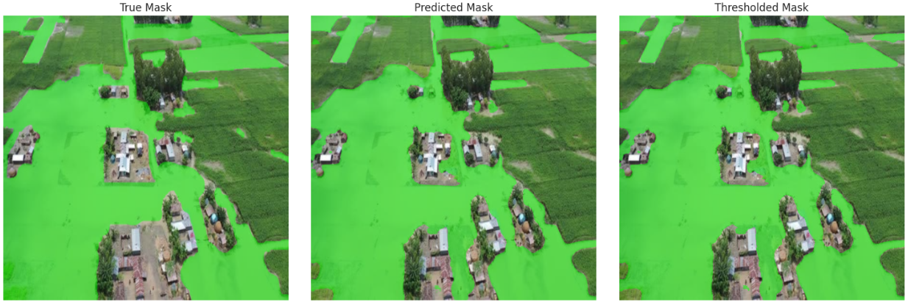

#U-Net for Image Segmentation
Overview
Image segmentation is a fundamental task in computer vision that involves partitioning an image into meaningful segments or objects. The U-Net architecture, originally developed for biomedical image segmentation, has gained widespread adoption due to its ability to achieve precise pixel-wise segmentation.

This repository provides an implementation of U-Net, trained on image-mask pairs, to delineate object boundaries effectively. The model is applicable across various domains, including medical imaging, autonomous driving, satellite imagery, and agricultural monitoring.

